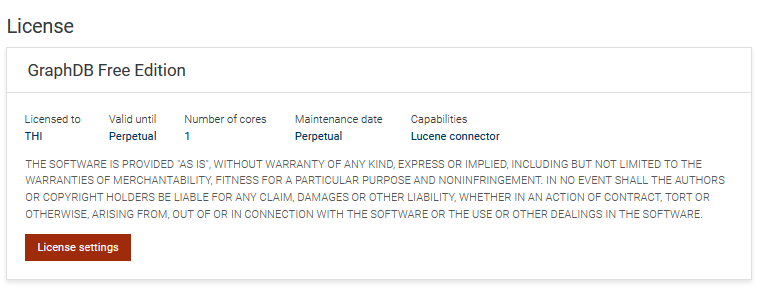

# Kapitel 11 (NoSQL) -- Graph-Datenbanken: GraphDB

------------------------------------------------------------------------

## Voraussetzungen

Für dieses Kapitel benötigen Sie:

-   **Docker**
-   Grundkenntnisse der Kommandozeile
-   das geklonte Repository dieses Buchs

Falls Sie Docker noch nicht installiert haben:

https://docs.docker.com/get-docker/

------------------------------------------------------------------------

## GraphDB mit Docker Container starten

Wechseln Sie in das Verzeichnis, welches die Datei `docker-compose.yml` für GraphDB enthält. Starten Sie den Container mit 

    docker compose up -d

Sie können den Status des Containers mit den folgenden Befehlen prüfen: 

    docker compose ps
    docker compose logs -f graphdb

------------------------------------------------------------------------

## GraphDB aufrufen 

Nach dem Start erreichen Sie die Datenbank unter http://localhost:7200/ aufrufen.

------------------------------------------------------------------------

## GraphDB registrieren

Vor dem Start der Nutzung der Workbench muss zunächst noch eine Lizenz hochgeladen werden. Auch die freie Edition erfordert eine Registrierung über die GraphDB-Webseite unter Angabe einer E-Mail-Adresse.

------------------------------------------------------------------------

# Daten laden

Unter dem Reiter `Import` kann die `starwars.trig` Datei aus dem Repository geladen werden. Diese stammt aus dem Repository 
https://graphdb.ontotext.com/documentation/master/_downloads/9ad0c85c635a3d1db4e23a806691f263/starwars.trig

------------------------------------------------------------------------

# Beispiele aus dem Buch ausführen (CLI)

Die Beispiele aus dem Buch können im SPARQL Editor ausgeführt werden. Im folgenden Beispiel werden die 20 Klassen mit den meisten Instanzen extrahiert. 

    PREFIX rdf: <http://www.w3.org/1999/02/22-rdf-syntax-ns#>
    SELECT ?class (COUNT(*) AS ?n)
    WHERE { ?s rdf:type ?class }
    GROUP BY ?class
    ORDER BY DESC(?n)
    LIMIT 2

------------------------------------------------------------------------

## Container stoppen

Wenn Sie GraphDB nicht mehr benötigen, können Sie den Container stoppen:

    docker stop graphdb

------------------------------------------------------------------------

## Container entfernen (Reset)

Falls Sie das Kapitel komplett zurücksetzen möchten:

    docker rm graphdb

Danach können Sie GraphDB erneut starten.

------------------------------------------------------------------------

# Fehlerbehebung (Debugging)

Falls GraphDB nicht wie erwartet funktioniert, können die folgenden Befehle bei der Fehlersuche helfen.

## Laufende Container anzeigen

Überprüfen Sie zunächst, ob der Container läuft:

    docker ps

Der Container `graphdb` sollte in der Liste erscheinen.

Wenn Sie auch gestoppte Container sehen möchten:

    docker ps -a

## Container-Logs anzeigen

Falls der Container nicht startet oder Fehler auftreten, können Sie die Logs anzeigen:

    docker logs graphdb

Diese enthalten oft Hinweise auf Konfigurationsprobleme oder Portkonflikte.
