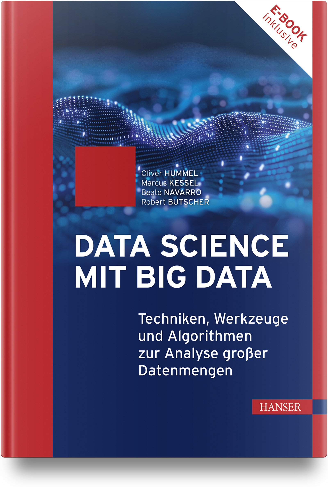

# Data Science mit Big Data: Techniken, Werkzeuge und Algorithmen zur Analyse großer Datenmengen

<a href="https://www.linkedin.com/in/oliver-hummel-hsma"></a>
<a href="https://www.linkedin.com/in/marcus-kessel-307609312/"></a>
<a href="https://www.linkedin.com/in/beate-navarro-9326ba112/"></a>
<a href="https://www.linkedin.com/in/prof-dr-robert-butscher-09a7481b1/"></a>

<p align="center"><b><i>"Data Science mit Big Data: Techniken, Werkzeuge und Algorithmen zur Analyse großer Datenmengen
"</i></b></p>

von [Oliver Hummel](https://www.linkedin.com/in/oliver-hummel-hsma), [Marcus Kessel](https://www.linkedin.com/in/marcus-kessel-307609312/), [Beate Navarro](https://www.linkedin.com/in/beate-navarro-9326ba112/) und [Robert Butscher](https://www.linkedin.com/in/prof-dr-robert-butscher-09a7481b1/).

---

<p align="center">
  
</p>

<br>

Dieses Repository enthält alle Code-Beispiele aus dem Hanser-Buch **"Data Science mit Big Data"**.

## 📚 Das Buch

Dieses Buch ist im gut sortierten Buchhandel und beispielsweise hier erhältlich:

* [Verlagsseite](https://www.hanser-fachbuch.de/fachbuch/artikel/9783446476400)
* [Amazon](https://www.amazon.de/Data-Science-mit-Big-Algorithmen/dp/3446476407)
* [Buecher.de](https://www.buecher.de/shop/home/artikeldetails/A1075047159)

**ISBN:** 978-3-446-47640-0  
**Seiten:** 783 (Komplett in Farbe)  
**Auflage:** 1. Auflage (2026)

---

## 🎯 Übersicht

**"Data Science mit Big Data"** verbindet theoretisch fundierte Konzepte mit praktischen Anwendungen – von den Grundlagen verteilter Systeme bis hin zu modernen KI-Technologien.

### Was Sie erwartet:

✅ **Umfassender Überblick** über Big-Data-Technologien und -Architekturen  
✅ **Praktische Code-Beispiele** in Python, Java, R und mehr  
✅ **Moderner Stack**: Spark, Flink, Kafka, Delta Lake, NoSQL-Datenbanken  
✅ **KI-Integration**: LLMs, RAG, Agenten und Fine-Tuning  
✅ **DevOps & Betrieb**: Kubernetes, Docker, Testing & Monitoring  

---

## 📖 Inhalt

### Kapitelübersicht mit Code-Beispielen

| Kapitel | Thema | Code-Beispiele | Notebook |
|---------|-------|----------------|----------|
| **1** | [Gestatten, Data – Big Data](Kapitel01/README.md) | Google Trends Analyse, Big Data Use Cases | [Colab](https://colab.research.google.com/drive/1i0Ps58-uQ8LrlESNdbpelbCoJVVQq8XY), [Colab](https://colab.research.google.com/drive/1_FB_UU_w37TzLQQTSNSLSb1ysvpJaFMX) |
| **2** | [Grundbegriffe verteilter Systeme](Kapitel02/README.md) | — | — |
| **3** | [Daten](Kapitel03/README.md) | — | — |
| **4** | [Vorgehensmodelle für Big Data](Kapitel04/README.md) | — | — |
| **5** | [Datenformate](Kapitel05/README.md) | CSV, JSON, Parquet, Avro (Pandas, PyArrow, Spark) | — |
| **6** | [Big Data-Management](Kapitel06/README.md) | — | — |
| **7** | [Data Warehouse](Kapitel07/README.md) | DuckDB, Python (OBT, Sternschema) | [Colab](https://colab.research.google.com/drive/13R9qWj-Fg1NM14N0DJjdOqu9ubbZSCO-?usp=sharing), [Colab](https://colab.research.google.com/drive/14_TK9bW-DckERo4YLzrsh7hwlEeOUzYU?usp=sharing) |
| **8** | [Data Lake](Kapitel08/README.md) | — | — |
| **9** | [Data Lakehouse](Kapitel09/README.md) | — | — |
| **10** | [Data Mesh](Kapitel10/README.md) | Data Mesh Manager | — |
| **11** | [NoSQL-Datenbanken](Kapitel11/README.md) | Redis, MongoDB, Neo4j, Cassandra, InfluxDB, Milvus, ArangoDB, OpenSearch, Delta Lake | — |
| **12** | [Kafka & Stream Processing](Kapitel12/README.md) | Kafka Producer/Consumer (Python) | — |
| **13** | [Verarbeitungsparadigmen](Kapitel13/README.md) | Hadoop, Spark, Flink, Ignite (Java, Python) | — |
| **14** | [Skalierbare Algorithmen](Kapitel14/README.md) | Morris-Counter, HyperLogLog, Bloom-Filter, t-digest (Java) | — |
| **15** | [Datenanalyse & Visualisierung](Kapitel15/README.md) | Matplotlib, Seaborn, ggplot2, Echtzeit-Monitoring | — |
| **16** | [Architekturwissen](Kapitel16/README.md) | — | — |
| **17** | [Test & Betrieb](Kapitel17/README.md) | Kubernetes (minikube) | — |
| **18** | [KI-basierte Systeme](Kapitel18/README.md) | Training, RAG, Agenten, MCP (Python) | — |

---

## 🚀 Schnellstart

### Voraussetzungen

- **Docker** und **Docker Compose** (für Datenbanken und Infrastruktur)
- **Python 3.10+** (für die meisten Beispiele)
- **Java 11+** (für Hadoop, Spark Java, und Algorithmen)
- **R** (für ggplot2-Beispiele)

### Beispiele ausführen

Jedes Kapitel enthält eine eigene `README.md` mit detaillierten Anleitungen. Typischerweise abhängig von der verwendeten Programmiersprache und dem Deployment (beispielsweise Docker).

---

## 🎓 Für wen ist dieses Buch?

### Zielgruppe

- **Data Scientists** und **Data Engineers**, die einen umfassenden Überblick über Big Data-Technologien erhalten möchten
- **Entwickler**, die praktische Code-Beispiele für verteilte Systeme suchen
- **Studenten** (Bachelor/Master) im Bereich Data Science, Informatik oder Wirtschaftsinformatik
- **Architekten** und **Tech Leads**, die sich mit Big-Data-Architekturen auseinandersetzen
- **DevOps Engineers**, die Big-Data-Systeme betreiben möchten
- ...

### Vorkenntnisse

- Grundkenntnisse in **Python** (für die meisten Beispiele)
- Grundlegendes Verständnis von **Datenbanken** und **Verteilte Systeme** hilft, ist aber nicht zwingend erforderlich
- Für Java-Beispiele: Grundkenntnisse in **Java**
- Für R-Beispiele: Grundkenntnisse in **R**

---

## 📝 Errata (Updates)

In Abschnitt 14.3 auf Seite 542 muss es natürlich `bf.put(4)` bzw. `bf.put(7)` statt `filter.put(...)` heißen.

---

## 📚 Weitere Ressourcen

### Bonusmaterial
- [Video zur Datenanalyse mit SQL und Zeppelin](https://www.youtube.com/watch?v=JnaUPJiftrM)

### Zitierung

Wenn Sie dieses Buch zitieren möchten, verwenden Sie gerne folgenden BibTeX-Eintrag:

```bibtex
@book{hummel2026bigdata,
  author    = {Hummel, Oliver and Kessel, Marcus and Navarro, Beate and Butscher, Robert},
  title     = {Data Science mit Big Data: Techniken, Werkzeuge und Algorithmen zur Analyse gro{\ss}er Datenmengen},
  publisher = {Carl Hanser Verlag},
  address   = {M{\"u}nchen},
  year      = {2026},
  edition   = {1. Auflage},
  isbn      = {978-3-446-47640-0},
  note      = {783 Seiten, Komplett in Farbe}
}
```

---

## 🤝 Autoren

- **Oliver Hummel** ([LinkedIn](https://www.linkedin.com/in/oliver-hummel-hsma))
- **Marcus Kessel** ([LinkedIn](https://www.linkedin.com/in/marcus-kessel-307609312/))
- **Beate Navarro Bullock** ([LinkedIn](https://www.linkedin.com/in/beate-navarro-9326ba112/))
- **Robert Butscher** ([LinkedIn](https://www.linkedin.com/in/prof-dr-robert-butscher-09a7481b1/))

---

*Letzte Aktualisierung: 14. März 2026*
